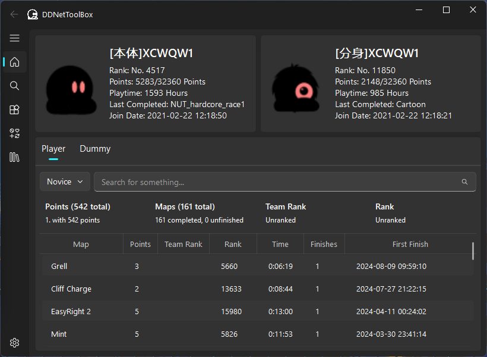
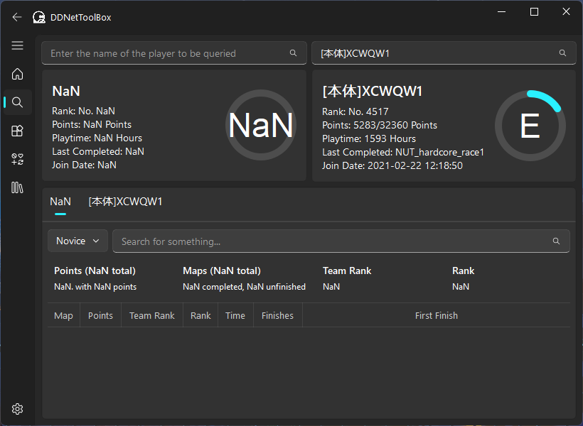
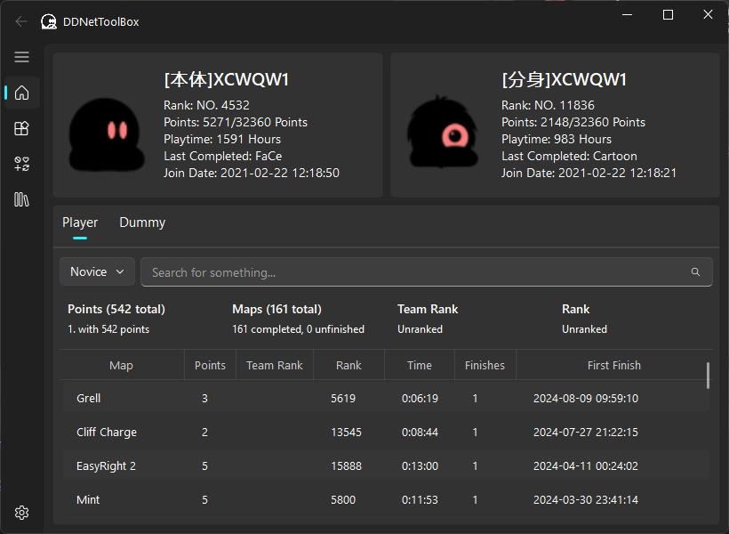
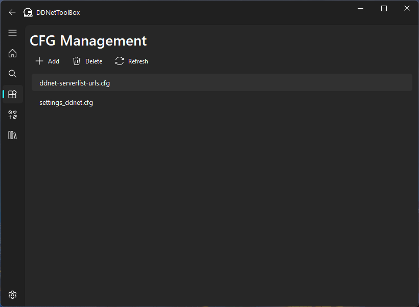
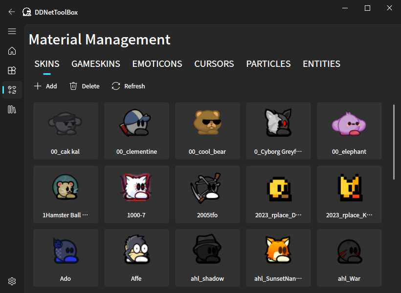
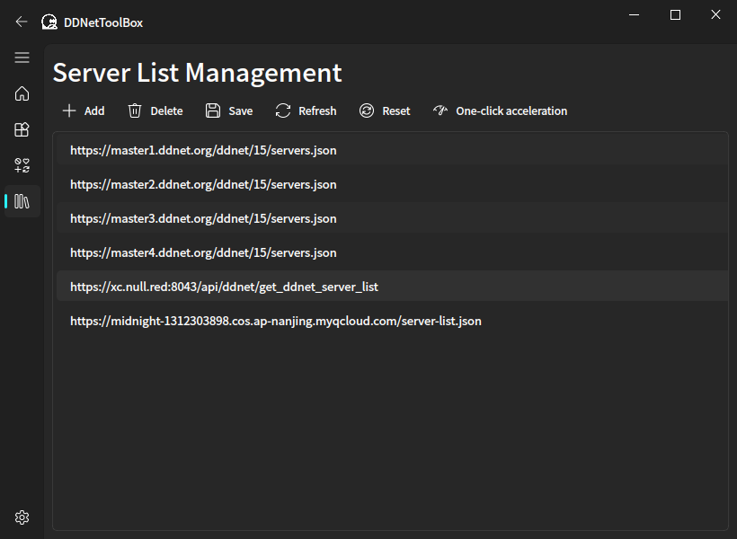
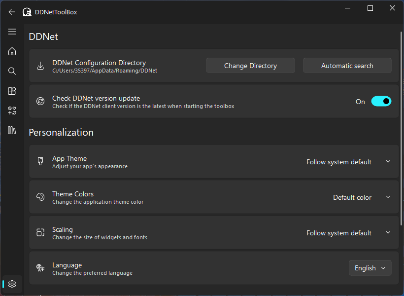

  
# DDNetToolBox

A toolbox for [DDRaceNetwork](https://ddnet.org/)

 

  

English | <a href="README_zh.md">简体中文</a>

> If you have any suggestions or problems during use, please raise an Issue

### Get Started：

- Download the version of the corresponding platform from Releases, and double-click to open it after downloading.

### Special thanks to the following projects and contributors：

- [PyQt-Fluent-Widgets](https://github.com/zhiyiYo/PyQt-Fluent-Widgets) - A fluent design widgets library based on C++ Qt/PyQt/PySide.
- Realyn//UnU - Created a logo for this project

### Software Screenshots

