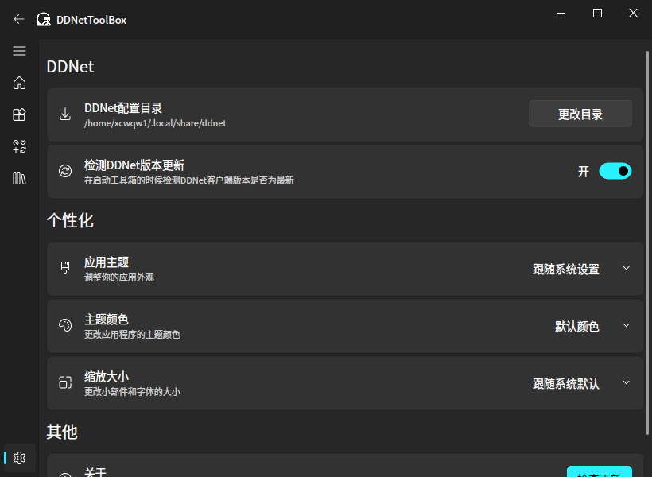

  
# DDNetToolBox

一个适用于 [DDRaceNetwork](https://ddnet.org/) 的工具箱

 

  

<a href="README.md">English</a> | 简体中文

> 有任何建议或使用中出现了问题，请发起Issues或加入QQ群内反馈：818266207

### 开始使用：

- 从 Releases 中下载对应平台的版本，下载后双击打开即可
- 如果下载速度缓慢可加入QQ从群文件内下载

### 特别感谢以下项目和贡献者：

- [PyQt-Fluent-Widgets](https://github.com/zhiyiYo/PyQt-Fluent-Widgets) - 基于 C++ Qt/PyQt/PySide 的流畅设计小部件库。
- Realyn//UnU - 为本项目制作了logo

### 软件截图

